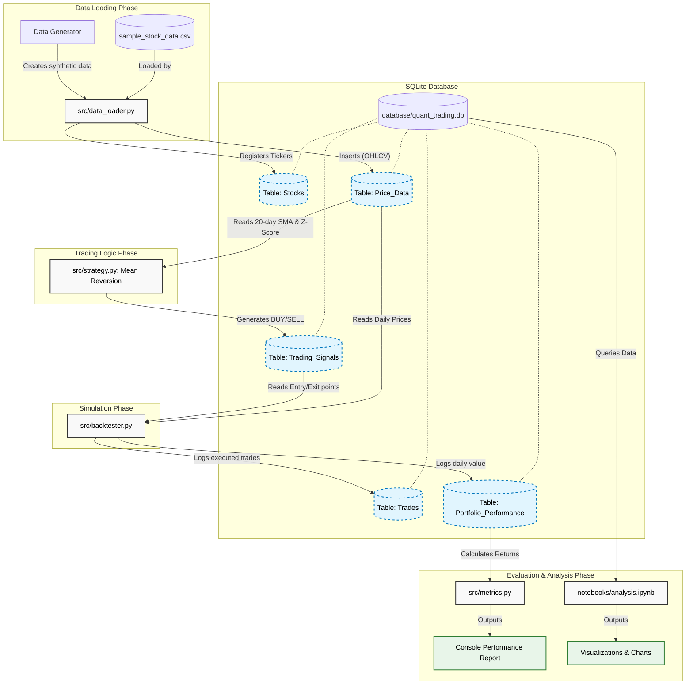

# Quantitative Trading DBMS Architecture

This document contains the data flow and architectural diagram for the Database-Driven Quantitative Trading Strategy Engine.

```mermaid
graph TD
    %% Define Styles with black text color for visibility
    classDef script fill:#f9f9f9,stroke:#333,stroke-width:2px,color:#000;
    classDef database fill:#e1f5fe,stroke:#0277bd,stroke-width:2px,stroke-dasharray: 5 5,color:#000;
    classDef output fill:#e8f5e9,stroke:#2e7d32,stroke-width:2px,color:#000;

    %% Data Pipeline
    subgraph Data Loading Phase
        CSV[(sample_stock_data.csv)] -->|Loaded by| Loader[src/data_loader.py]
        Generator[Data Generator] -->|Creates synthetic data| Loader
    end

    %% Database
    subgraph SQLite Database
        DB[(database/quant_trading.db)]
        table_stocks[(Table: Stocks)]
        table_prices[(Table: Price_Data)]
        table_signals[(Table: Trading_Signals)]
        table_trades[(Table: Trades)]
        table_perf[(Table: Portfolio_Performance)]
        
        DB -.- table_stocks
        DB -.- table_prices
        DB -.- table_signals
        DB -.- table_trades
        DB -.- table_perf
    end

    %% Flow through the system
    Loader -- "Inserts (OHLCV)" --> table_prices:::database
    Loader -- "Registers Tickers" --> table_stocks:::database
    
    subgraph Trading Logic Phase
        Strat[src/strategy.py: Mean Reversion]
        table_prices -->|Reads 20-day SMA & Z-Score| Strat
        Strat -- "Generates BUY/SELL" --> table_signals:::database
    end

    subgraph Simulation Phase
        Backtester[src/backtester.py]
        table_prices -->|Reads Daily Prices| Backtester
        table_signals -->|Reads Entry/Exit points| Backtester
        Backtester -- "Logs executed trades" --> table_trades:::database
        Backtester -- "Logs daily value" --> table_perf:::database
    end

    subgraph Evaluation & Analysis Phase
        Metrics[src/metrics.py]
        Notebook[notebooks/analysis.ipynb]
        
        table_perf -->|Calculates Returns| Metrics
        Metrics -->|Outputs| Report[Console Performance Report]:::output
        
        DB -->|Queries Data| Notebook
        Notebook -->|Outputs| Charts[Visualizations & Charts]:::output
    end
    
    %% Assign classes
    class Loader,Strat,Backtester,Metrics,Notebook script;
```
